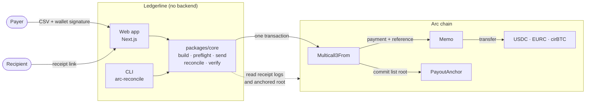

# Ledgerline

**Batched stablecoin payouts on Arc where every payment carries its own invoice
reference on chain, so the payer and the recipient can each reconcile it
without trusting the other, or us.**

One transaction, signed by the payer, can pay USDC, EURC and cirBTC to many
recipients. Each payment is tied to its invoice by Arc's protocol-native `Memo`,
and the whole list is committed to a Merkle root on chain. Anyone holding the
transaction hash and an RPC URL can rebuild the reconciliation table. Ledgerline's
servers are never part of the proof.

> [!WARNING]
> **Early software that moves real money.** The contract and the payment code
> have been reviewed only internally. There has been no independent security
> audit. Use a dedicated wallet and small amounts. See [Security](#security).

## How it works



The payer signs one transaction. Everyone else reads it back from the chain.
The [architecture overview](docs/architecture-overview.md) and
[ARCHITECTURE.md](ARCHITECTURE.md) go further.

Arc ships two predeployed contracts that make a reference native to the
payment. `Memo` wraps a call and emits an indexed reference. `Multicall3From`
batches calls while keeping the signing EOA as `msg.sender`. Ledgerline puts
them together in one transaction:

```text
payer EOA
  └─► Multicall3From.aggregate3([
        PayoutAnchor.commit(clientRunId, merkleRoot, itemCount),   // the list, committed
        Memo.memo(USDC,   transfer(r1, a1), memoId1, …),           // payment + reference
        Memo.memo(EURC,   transfer(r2, a2), memoId2, …),
        Memo.memo(cirBTC, transfer(r3, a3), memoId3, …),
      ])
```

- **Payments are joined to references cryptographically, not by position.**
  `Memo` records `callDataHash = keccak256(transfer(to, value))`. The reconciler
  rebuilds that hash from each `Transfer` log. A match proves the payment
  belongs to the reference, whatever order the logs arrive in.
- **References are private.** `memoId = keccak256(runSalt ‖ invoiceId)`. The
  salt comes from a signature by the payer's wallet and is stored nowhere, so an
  observer cannot read invoice ids or link payment cycles. Receipt links carry
  the salt, and a lost salt can be regenerated by signing again.
- **The list is committed on chain.** `PayoutAnchor` stores the Merkle root of
  the payout list and the item count the payer declares. A recipient can prove
  their line is on the list, and can see that a run declared five payments while
  three arrived, without asking the payer. A run file handed over later is
  checked against the root, so it cannot be edited to match what was paid. The
  anchor makes a gap between the list and the payments detectable. It does not
  prevent a wrong payment.
- **Paying the same list twice reverts.** The run id is derived from the payer,
  the list and the run name, such as `2026-09`. Committing it again reverts with
  `RunExists()`, and because the anchor call cannot fail independently, the
  whole batch reverts with it. Next month's identical payroll gets its own run name.

`PayoutAnchor` is never the caller in the payment path. Arc's `CallFrom`
rejects sender spoofing, so a contract that called `Memo` on the payer's behalf
would revert. The anchor is a sibling subcall, and every `Transfer.from` is the
payer. It holds no funds and takes no approvals. It has no owner and cannot be
upgraded. If it failed, money would still move.

### What a recipient can verify

A receipt link opens a page that runs five checks against the chain:

1. The transaction exists and succeeded.
2. A payment to the recipient is present.
3. The payment belongs to this invoice, by the calldata-hash join.
4. The payer signed the transaction directly.
5. The payment is on the list the payer committed, by Merkle proof against the anchor.

The page can be pointed at any RPC endpoint. It reads the chain directly and
uses no Ledgerline backend.

## Usage

### Paying a run

1. Open the app (see [Run the web app](#run-the-web-app)) and connect an EOA
   wallet on Arc, such as MetaMask or Rabby.
2. Go to **New payout** and upload a CSV (format below). Name the run for its
   period, such as `2026-09`.
3. Review the list and sign the run name. That signature derives the salt that
   keeps your invoice references private. Ledgerline then simulates every
   payment against the chain.
4. Pay. When the receipt arrives, download the **run file** and send each
   recipient their **receipt link**.

Keep the run file: it holds your invoice ids, and the chain proves it has not
been changed. If you lose the receipt links, the run's page rebuilds them from
the run name and the invoice references once you sign the run name again.

### CSV format

```csv
invoiceId,token,to,amount
INV-US-001,USDC,0xe48A096B9E74f064b13c17734af29F85E02d732a,0.10
INV-EU-002,EURC,0xe48A096B9E74f064b13c17734af29F85E02d732a,0.10
INV-BTC-003,cirBTC,0xe48A096B9E74f064b13c17734af29F85E02d732a,0.00001
```

| Column | Rules |
|---|---|
| `invoiceId` | Your reference for the payment. Required and unique within the file |
| `token` | `USDC`, `EURC` or `cirBTC` (not case-sensitive) |
| `to` | The recipient's address. Not the zero address |
| `amount` | A positive amount in whole tokens, written as on an invoice: `0.10`, not base units. No more decimal places than the token has (6 for USDC and EURC, 8 for cirBTC). Scientific notation, thousands separators and negative values are rejected |

- The header must read exactly `invoiceId,token,to,amount`. A reordered column
  is rejected rather than guessed at.
- A file holds at most 400 rows, to stay under Arc's block gas limit. Split a
  larger payroll into several runs.
- Every problem is reported at once, with its line number. A second payment to
  the same recipient in the same token is allowed, with a warning.

### Reconciling a run

Anyone can rebuild a run's reconciliation table from its transaction hash:

```bash
pnpm reconcile <txHash>                              # Arc mainnet
pnpm reconcile <txHash> --network testnet
pnpm reconcile <txHash> --manifest <run file>.json   # adds invoice ids, checks the file against the anchored root
pnpm reconcile <txHash> --rpc <your own node>
```

Without the run file every payment reads `paid`, and completeness is checked
against the anchor. With it, each row is matched to its invoice.

## Development

Requirements: Node 22, pnpm 10, and [Foundry](https://book.getfoundry.sh/) for
the contracts.

```bash
git clone --recurse-submodules https://github.com/hms1499/ledgerline.git
cd ledgerline
pnpm install
```

### Test

```bash
pnpm test                  # core, cli and web (vitest)
pnpm typecheck
cd contracts && forge test
```

### Run the web app

```bash
cp frontend/.env.example frontend/.env.local   # every value is public: contract addresses and tx hashes
pnpm --filter @ledgerline/core build
pnpm --filter @ledgerline/web dev
```

The app runs on Arc mainnet and says so before anything is signed. Add
`?n=testnet` to any page to try it with tokens that have no value, from the
[Circle faucet](https://faucet.circle.com).

### Send a run from the command line

```bash
cp .env.example .env    # PRIVATE_KEY, DEMO_RECIPIENT, ANCHOR_TESTNET / ANCHOR_MAINNET
npx tsx --env-file=.env scripts/run-payout.ts --network mainnet --dry-run   # preflight only, signs nothing
npx tsx --env-file=.env scripts/run-payout.ts --network mainnet
```

`--network` is required: the scripts never choose a network on their own.
Rehearse with `--network testnet` first. Use a wallet created for this purpose.
`.env` is gitignored.

### Repository layout

```text
packages/core     The reconciler and everything that must agree between script and browser:
                  CSV validation, run building, Merkle proofs, preflight, gas policy,
                  receipt verification, completeness. reconcile() is a pure function over logs.
packages/cli      arc-reconcile: rebuilds a run's table from a tx hash and an RPC URL.
frontend          Next.js app: create a run, the payer's dashboard, run pages, receipts, /why.
contracts         PayoutAnchor (Foundry), its tests, and the deploy script.
scripts           run-payout.ts and naive-batch.ts, used for the testnet and mainnet proofs.
docs              Design specs, implementation plans, and dated notes of what was measured on chain.
```

## Deployments

| Network | `PayoutAnchor` |
|---|---|
| Arc mainnet (5042) | [`0xd4838881EcBa8320d456B8B65A07A0ac167F0890`](https://explorer.arc.io/address/0xd4838881EcBa8320d456B8B65A07A0ac167F0890?tab=contract), source-verified |
| Arc testnet (5042002) | `0xb8907A07768D936D1D498257E5803c91033a8802` |

### Mainnet proof

A three-token run and the same payment through a standard `Multicall3`, both on
Arc mainnet:

| | |
|---|---|
| One transaction, three tokens, three invoices | [`0xaf3e6194…e738e4c0`](https://explorer.arc.io/tx/0xaf3e61940847555a93ac9880a44c3f16e08a4ea80d2f43c69a28a949e738e4c0): 0.10 USDC · 0.10 EURC · 0.00001 cirBTC |
| Standard `Multicall3`, for comparison | [approve](https://explorer.arc.io/tx/0x75663aaf2d6b41ffa656ad63f0e98739de59c24826deedfa6e0f5cdf52896c34), then [batch](https://explorer.arc.io/tx/0x08c578c541dc40cd23d181e0f637a760e3ef7f71286fdc945196c434caed5905) |

Rebuilt from a public RPC:

```console
$ pnpm reconcile 0xaf3e61940847555a93ac9880a44c3f16e08a4ea80d2f43c69a28a949e738e4c0

  Ledgerline reconciliation — 0xaf3e61940847555a93ac9880a44c3f16e08a4ea80d2f43c69a28a949e738e4c0
  Arc mainnet   RPC: https://rpc.mainnet.arc.io   block 22453870

  status                invoice           recipient    amount
  ────────────────────────────────────────────────────────────────────────
  paid                  —                 0xe48A096B…  0.1 USDC
  paid                  —                 0xe48A096B…  0.1 EURC
  paid                  —                 0xe48A096B…  0.00001 cirBTC

  3 referenced payment(s) found.
  Completeness: complete — All 3 recorded payments are present.
```

Measured at the proof run's 21 Gwei effective gas price. Gas is paid in USDC.

| | Gas | Cost | Per payment |
|---|---:|---:|---:|
| Ledgerline: 3 payments, 3 tokens, referenced and anchored, 1 transaction | 266,370 | 0.0056 USDC | 88,790 gas |
| Standard Multicall3: 1 payment, approve + batch, 2 transactions, no reference | 114,193 | 0.0024 USDC | 114,193 gas |

The two rows are different batch sizes, so read the per-payment difference as
indicative. Gas per payment falls as a batch grows. The full record is in
[`docs/notes/2026-09-24-mainnet-proof.md`](docs/notes/2026-09-24-mainnet-proof.md).

## Security

- **No independent audit.** `PayoutAnchor` had an internal pre-mainnet review.
  Each finding was reproduced as a test. Most were fixed before deploy, and the
  rest are recorded as accepted, with the reason
  ([notes](docs/notes/2026-09-21-preflight-audit.md),
  [`Audit.t.sol`](contracts/test/Audit.t.sol)). That review is not a substitute
  for an audit by a third party.
- **What the anchor proves, and what it does not.** It proves the payer
  committed a list with a given root. It cannot check that list against the
  payments in the same transaction, because Arc forbids it from being their
  caller, and the item count is the payer's declaration. The reconciler compares
  the list with what was paid, so a divergence is visible. It is not prevented.
- **The contract cannot touch funds.** Payments move by direct ERC-20
  `transfer` calls from the payer's own wallet. `PayoutAnchor` holds no
  balance, takes no approvals, and has no owner or upgrade path. A defect in it
  could make the evidence wrong. It cannot move or lock money.
- **Nothing is reported as paid without a receipt.** Arc silently drops
  transactions priced under 20 Gwei. The payment code floors fees at 25 Gwei,
  checks the fee the wallet actually broadcast, and reports a missing receipt
  as pending or dropped, never as paid.
- **Secrets stay with the payer.** The salt that keeps references private is
  derived from the payer's signature and never stored. Receipt links contain
  it, so share each link only with its recipient.

Please report vulnerabilities privately to the maintainer rather than in a
public issue.

## Limitations

- **EOA wallets only.** Arc's `Memo` requires a direct EOA caller, so Safe,
  ERC-4337 and other smart-contract wallets cannot pay this way.
- **ERC-20 `transfer` payments only.** Native value sends are out of scope.
- **At most 400 payments per run.**
- **Not a payroll or accounting system.** There are no user accounts, approvals,
  tax handling, fiat rails or ERP integrations. The payer's run history is kept
  in their browser. The chain is the record.

## Arc behaviour this handles

These are chain properties that cannot be seen by reading the code. Each one
was measured on Arc and is handled in `packages/core`.

| Arc behaviour | What Ledgerline does |
|---|---|
| A transaction with `maxFeePerGas` under 20 Gwei is dropped silently, with no receipt and no error | Floors fees at 25 Gwei, checks the fee the wallet actually broadcast, and never reports a payment without a receipt |
| One USDC transfer emits two `Transfer` logs: 6-decimal from the token and 18-decimal from the system emitter. EURC and cirBTC emit one | Ignores the system emitter `0xffff…fFfE` entirely, so no token is double-counted or halved |
| USDC is 18-decimal as native value and 6-decimal through `balanceOf` | Reads decimals from each token contract. An amount whose decimals cannot be read is shown unscaled, never in a guessed scale |
| `Memo` requires a direct EOA caller | The app says up front that Safe, ERC-4337 and other smart-contract wallets cannot pay this way |
| `eth_call` forces `msg.sender == tx.origin`, so simulation cannot test the anti-spoofing rule | The caller rules were established with real testnet transactions, not simulation |
| The public RPC caps `eth_getLogs` at 2,000 results / ~10k blocks | No flow searches history. Everything reads a known transaction or a storage slot |

## Prior art

Payment references are not a new idea. Stellar memos, XRP destination tags and
similar fields have attached references to payments for about a decade, and
[Request Network](https://request.network/) does salted payment references with
batch payments on several EVM chains. Ledgerline takes the salted-reference
design from Request.

What is specific to Arc:

- The reference is Arc's own `Memo` predeploy, which can wrap any call, rather
  than a payment contract owned by one company.
- USDC, EURC and cirBTC are all native to Arc, so one transaction can pay USD,
  EUR and BTC, each with its own reference.
- `Memo`'s `callDataHash` makes the payment-to-reference join a hash
  comparison rather than a heuristic.

## Documentation

- [Architecture](ARCHITECTURE.md): how the pieces fit, the transaction layout,
  the codemap, and the decisions that are deliberate.
- [Design spec](docs/superpowers/specs/2026-09-21-ledgerline-design.md): the
  problem, the architecture and the measurements behind it. Claims are tagged
  `[measured]`, `[docs]` or `[unverified]`.
- [`docs/notes/`](docs/notes/): dated records of testnet findings, the
  pre-mainnet review, the negative control, the mainnet deploy and the mainnet proof.

## Acknowledgements

Built for Arc Microgrants on DoraHacks, on Arc's `Memo` and `Multicall3From`
predeploys.
