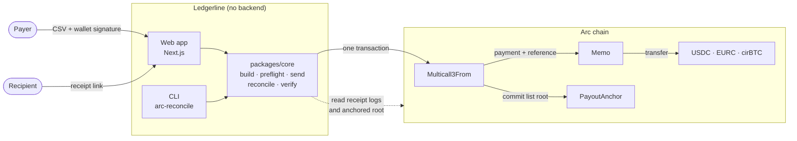
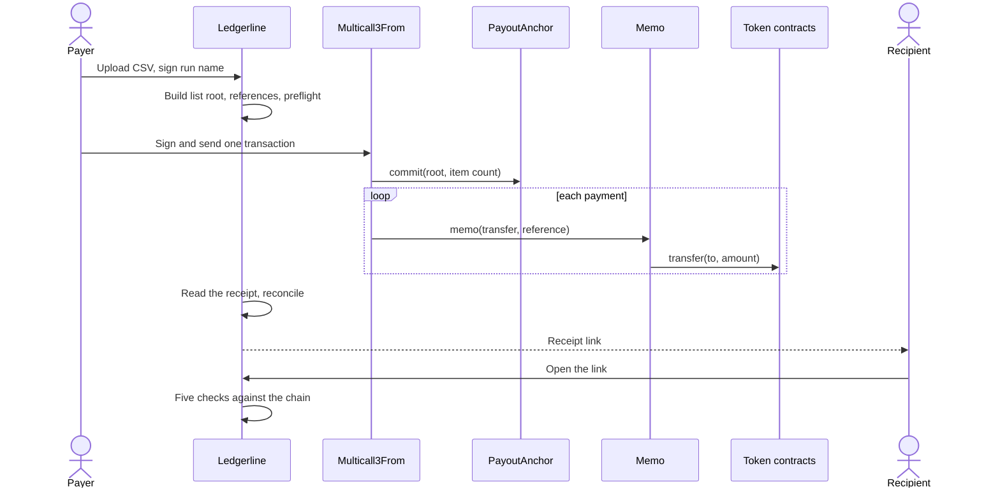

# Architecture overview

The payer sends one transaction that pays every line and records the list.
Everyone else reads that transaction back from the chain. Ledgerline has no
backend in between. For the details, see [ARCHITECTURE.md](../ARCHITECTURE.md).

## System

## One payout run

